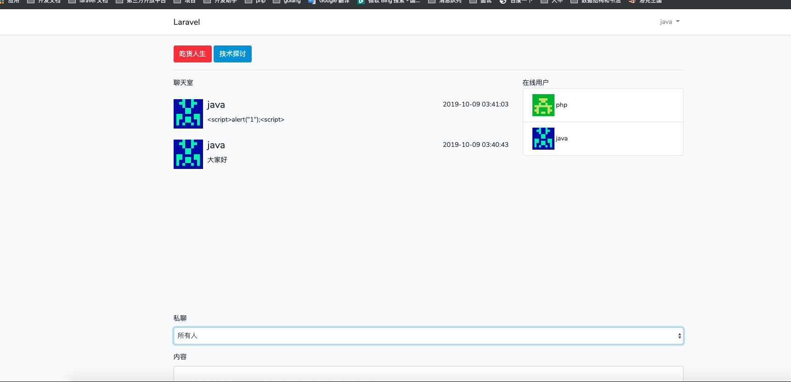
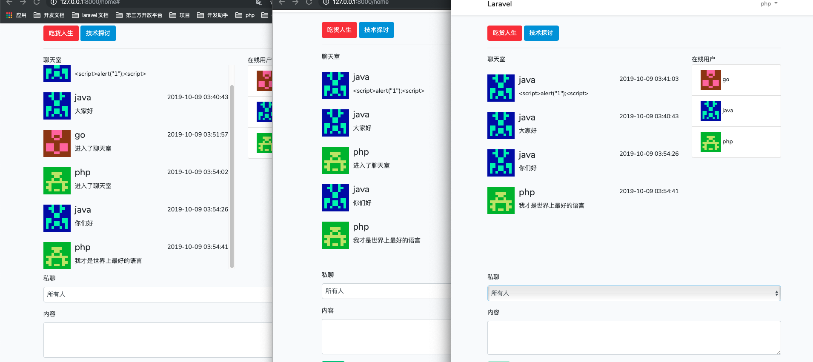
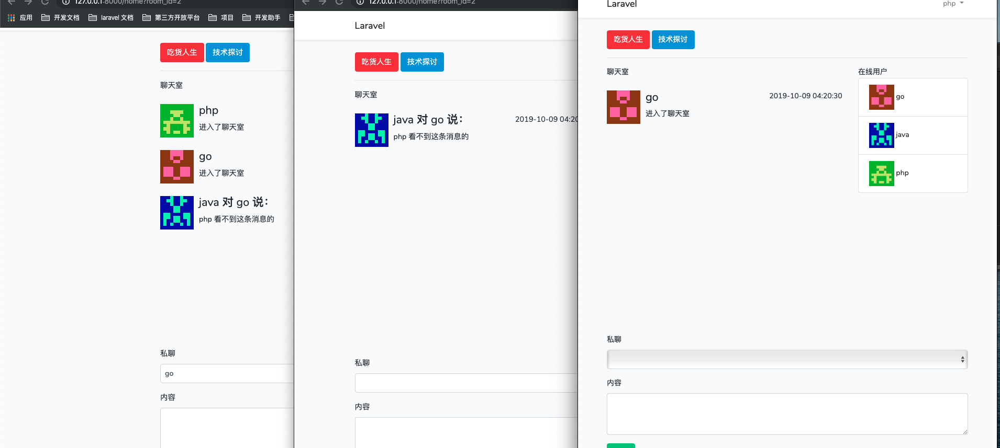

# laravel_gateway_vue_chat
Laravel+GatewayWorke+Vue 打造的多用户聊天室

#项目启动流程
>   
    // 1. 执行 composer install 安装相关扩展
    // 2. 执行 npm install 安装相关依赖
    // 3. 执行 cp .env.example .env 修改对应db配置
    // 4. 执行 php artisan migrate
    // 5. 执行 cd socket/GatewayWorker && php start.php start  启动ws服务
    // 6. 执行 php artisan serve 启动服务
    // 7. 访问 http://127.0.0.1:8080/
>
# 项目实现功能
>   
    1.进入聊天室
    2.聊天室房间选择
    3.发送聊天信息
    4.聊天历史记录
    5.在线用户列表
    6.私聊
    7.用户退出
    8.心跳检测
>
# 项目效果图
// 聊天室界面

// 聊天界面

// 私聊界面

